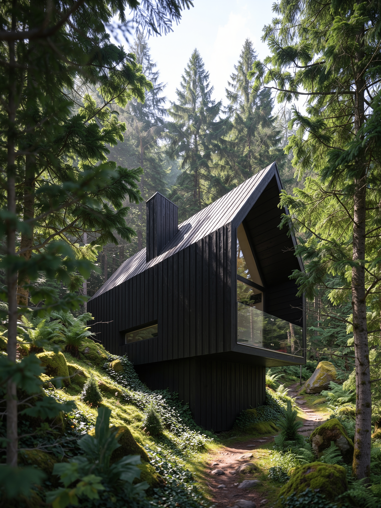

# 🏗️ PH's AIxArchviz ComfyUI Workflows (FLUX.2 + LTX-2.5)

**Dedicated to Architectural Imagery & Animation**

**Author:** Paul Hansen  
**Version:** v1.0_261002  
**License:** CC BY-SA 4.0
---



---

### 🏆 Sponsorship

-   Please consider sponsoring me if you find the results of my work useful. A good way to keep code development open and free is through sponsorship.

-   [](https://github.com/sponsors/paulh4x) . [](https://www.paypal.com/paypalme/paulh4x) . [](https://ko-fi.com/paulhansen)

---

## 📺 Showcase & Resources

* 🎥 **Showcase Video:** [https://youtu.be/6aXJqRhjXo0](https://youtu.be/6aXJqRhjXo0)
* ☁️ **Run it in the cloud:** [ComfyCloud](https://cloud.comfy.org/?via=ph01) (affiliate link, i may earn a commission)
* 💬 **Discord:** [PH's AIxArchviz Discord](https://discord.gg/3UW5ZaWpWq)
* 🌐 **Web:** [https://www.paulhansen.de](https://www.paulhansen.de)
* 📸 **Instagram:** [https://www.instagram.com/paulhansen.design/](https://www.instagram.com/paulhansen.design/)
* 💼 **LinkedIn:** [https://www.linkedin.com/in/ph3d](https://www.linkedin.com/in/ph3d)
* 🤗 **Custom LoRA:** [paulhax/flux2-klein-9b-localforestlab](https://huggingface.co/paulhax/flux2-klein-9b-localforestlab)

---

## 🎯 Overview

This is a complete rework of my [AIxArchviz SDXL x FLUX workflow](https://github.com/paulh4x/AIxArchviz_SDXLxFLUX), rebuilt from scratch around current models: **FLUX.2 [klein] 9B** for image generation and editing, **LTX-2.5** for camera-controlled image-to-video, and a **custom LoRA** trained for architectural vegetation.

Instead of one monolithic graph, the series is split into three focused workflows plus an all-in-one bundle. Each workflow is packed into subgraphs with only the relevant controls exposed, uses ComfyUI core nodes wherever possible, and runs locally or on ComfyCloud.

| Workflow | File | What it does |
|---|---|---|
| **IMAGE GENERATE** | [`ph_flux2_generate_V1.json`](workflows/ph_flux2_generate_V1.json) | Visually guided generation from 1–2 guidance images (depth, canny, normals, sketches, lineart, …) or plain text with FLUX.2 [klein] base 9B |
| **IMAGE EDIT** | [`ph_flux2_imageedit_V1.json`](workflows/ph_flux2_imageedit_V1.json) | Masked, reference-based editing without pixel degradation outside the mask, using FLUX.2 [klein] 9B, SAM 3.1 automasking and LanPaint |
| **CAMCONTROLLED IMAGE 2 VIDEO** | [`ph_ltx25_img2video_V1.json`](workflows/ph_ltx25_img2video_V1.json) | Turns a still into a video, with the camera move copied from a driving animation via LTX-2.5 and the Cameraman IC-LoRA |
| **ALL-IN-ONE** | [`ph_FLUX2xLTX_aio_V1.json`](workflows/ph_FLUX2xLTX_aio_V1.json) | All three stages in one graph: generate → edit → animate |

---

## ✨ Key Features

### Stage I – IMAGE GENERATE (FLUX.2 [klein] base 9B)
- **Visual guidance:** Load **1 or 2 guidance images** (up to 4 MP / 2048×2048) such as depth, canny, normals, sketches, lineart or scribbles straight from your 3D software, and toggle *USE 2 INPUT IMAGES* to match
- **TXT2IMG mode:** Ignore the input images and create free assets, e.g. references for IMAGE EDIT
- **Custom LoRA:** [`ph_f2k9b_localforestlab_v1`](https://huggingface.co/paulhax/flux2-klein-9b-localforestlab) for detailed trees & foliage (trigger word prefilled in the workflow: `phflg`)
- **Built-in upscale** with RealESRGAN x2 and a before/after image compare

### Stage II – IMAGE EDIT (FLUX.2 [klein] 9B)
- **Reference-based editing:** Load a base image (image 1) and a reference (image 2), then refer to both in your prompt, e.g. *"add the flamingo from image 2 to stand on the summer meadow in image 1, bright sunlight"*
- **Three ways to mask:** an RGB mask image, the ComfyUI Mask Editor, or **AUTOMASK BY PROMPT** (SAM 3.1)
- **Degradation-free:** Only the masked area is re-generated (crop & stitch) and the rest of the image stays pixel-identical
- **SOFTEN MASK** and **SEPARATE MASK COMPONENTS** (works best with SOFTEN MASK values below 5)
- **Auto-enhance, auto-remove and auto-outpaint** modes

### Stage III – CAMCONTROLLED IMAGE 2 VIDEO (LTX-2.5)
- **Camera control by example:** Load a still as the first frame and any video as the **driving camera animation**. The [Cameraman IC-LoRA by Cseti](https://huggingface.co/Cseti/LTX2.3-22B_IC-LoRA-Cameraman_v1) transfers the camera move
- **Ready-made driving animations** in [`assets/driving_animation`](assets/driving_animation): `crane_up`, `dolly_in`, `truck_right`, `truck_right_static_target`
- **Aspect ratio from your image:** Resolution snaps to multiples of 32, so expect slight cropping
- **Spatial latent upscale** plus **FILM frame interpolation** for smooth output, with audio generated alongside

---

## ✅ These Workflows ARE:

- **A potential replacement for many paid services** like image enhancement, AI editing and image-to-video
- **Tools developed for daily work** as a technical artist, from previsualization to final image and animation
- **Based on best intentions and latest findings** in AI-assisted architectural visualization
- **Flexible systems** you can adapt and modify to fit your own needs
- **Part of a complete workflow** that still includes 3D environments, rendering software and manual post-processing

---

## ❌ These Workflows ARE NOT:

- **Never-before-seen masterpiece ComfyUI workflows.** They're practical tools built from available components
- **Ultimate magic technology** that produces award-winning images every time
- **Standalone solutions.** You still need skills in 3D software, prompting and ComfyUI
- **Optimized for all hardware.** FLUX.2 [klein] 9B and LTX-2.5 22B need a capable GPU. If yours isn't, use the fp8/int8 variants or [ComfyCloud](https://cloud.comfy.org/?via=ph01)

---

## 🎯 Output Quality Depends On:

### Your 3D Skills
Your input is crucial. The workflows are designed for architecture-related imagery and assume you can:
- Work in a 3D environment (3ds Max, Blender, SketchUp, …)
- Export suitable guidance passes (depth, canny/outline, normals, segmentation masks)
- Create simple camera animations to use as driving videos

### Your Prompting Ability
- Describe materials, environment, light and camera clearly. See the example prompts in [`assets/inputs`](assets/inputs)
- In IMAGE EDIT, refer to *image 1* / *image 2* explicitly

### Your Hardware
- Use the fp8 / int8 model variants and lower resolutions on smaller GPUs
- All custom nodes used are available on ComfyCloud

---

## 📦 Models Used

Every workflow has a note with direct download links and the folder layout. **Gated** models need you to log in to huggingface and accept the license before downloading.

### FLUX.2 (Image Generate / Image Edit)

| Folder | Model | Used in |
|---|---|---|
| `diffusion_models` | [flux-2-klein-base-9b-fp8.safetensors](https://huggingface.co/black-forest-labs/FLUX.2-klein-base-9b-fp8/resolve/main/flux-2-klein-base-9b-fp8.safetensors) *(gated)* | Generate |
| `diffusion_models` | [flux-2-klein-base-9b.safetensors](https://huggingface.co/black-forest-labs/FLUX.2-klein-base-9B/resolve/main/flux-2-klein-base-9b.safetensors) *(gated)* | All-in-One (Generate); optional full-precision for Generate |
| `diffusion_models` | [flux-2-klein-9b.safetensors](https://huggingface.co/black-forest-labs/FLUX.2-klein-9B/resolve/main/flux-2-klein-9b.safetensors) *(gated)* | Edit, All-in-One |
| `text_encoders` | [qwen_3_8b.safetensors](https://huggingface.co/Comfy-Org/flux2-klein-9B/resolve/main/split_files/text_encoders/qwen_3_8b.safetensors) | Generate |
| `text_encoders` | [qwen_3_8b_fp8mixed.safetensors](https://huggingface.co/Comfy-Org/flux2-klein-9B/resolve/main/split_files/text_encoders/qwen_3_8b_fp8mixed.safetensors) | Edit, All-in-One |
| `loras` | [ph_f2k9b_localforestlab_v1.safetensors](https://huggingface.co/paulhax/flux2-klein-9b-localforestlab/resolve/main/ph_f2k9b_localforestlab_v1.safetensors) | Generate, Edit, All-in-One |
| `vae` | [flux2-vae.safetensors](https://huggingface.co/Comfy-Org/flux2-dev/resolve/main/split_files/vae/flux2-vae.safetensors) | Generate, Edit, All-in-One |
| `checkpoints` | [sam3.1_multiplex_fp16.safetensors](https://huggingface.co/Comfy-Org/sam3.1/resolve/main/checkpoints/sam3.1_multiplex_fp16.safetensors) | Edit, All-in-One |
| `upscale_models` | [RealESRGAN_x2.pth](https://huggingface.co/ai-forever/Real-ESRGAN/resolve/main/RealESRGAN_x2.pth) | Generate, Edit, All-in-One |

### LTX-2.5 (CamControlled Image 2 Video)

| Folder | Model |
|---|---|
| `diffusion_models` | [ltx-2.5-22b-distilled-transformer-comfy-int8-convrot.safetensors](https://huggingface.co/Lightricks/LTX-2.5/resolve/main/diffusion_models/ltx-2.5-22b-distilled-transformer-comfy-int8-convrot.safetensors) *(gated)* |
| `text_encoders` | [gemma4-12b-with-proj-ltx-2.5-comfy-int8-convrot.safetensors](https://huggingface.co/Lightricks/LTX-2.5/resolve/main/text_encoders/gemma4-12b-with-proj-ltx-2.5-comfy-int8-convrot.safetensors) *(gated)* |
| `loras` | [ltx-2.3-22b-distilled-lora-384.safetensors](https://huggingface.co/Lightricks/LTX-2.3/resolve/main/ltx-2.3-22b-distilled-lora-384.safetensors) |
| `loras` | [LTX2.3-22B_IC-LoRA-Cameraman_v1_10500.safetensors](https://huggingface.co/Cseti/LTX2.3-22B_IC-LoRA-Cameraman_v1/resolve/main/LTX2.3-22B_IC-LoRA-Cameraman_v1_10500.safetensors) by Cseti |
| `vae` | [ltx-2.5-video-vae-bf16.safetensors](https://huggingface.co/Lightricks/LTX-2.5/resolve/main/vae/ltx-2.5-video-vae-bf16.safetensors) *(gated)* |
| `vae` | [ltx-2.5-audio-vae-bf16.safetensors](https://huggingface.co/Lightricks/LTX-2.5/resolve/main/vae/ltx-2.5-audio-vae-bf16.safetensors) *(gated)* |
| `latent_upscale_models` | [ltx-2.5-latent-spatial-upscaler-x2-bf16-1.0.safetensors](https://huggingface.co/Lightricks/LTX-2.5/resolve/main/latent_upscale_models/ltx-2.5-latent-spatial-upscaler-x2-bf16-1.0.safetensors) *(gated)* |
| `frame_interpolation` | [film_net_fp16.safetensors](https://huggingface.co/Comfy-Org/frame_interpolation/resolve/main/frame_interpolation/film_net_fp16.safetensors) |

### Model Storage Location (All-in-One)

```
📂 ComfyUI/
└── 📂 models/
     ├── 📂 checkpoints/
     │    └── sam3.1_multiplex_fp16.safetensors
     ├── 📂 diffusion_models/
     │    ├── flux-2-klein-base-9b.safetensors
     │    ├── flux-2-klein-9b.safetensors
     │    └── ltx-2.5-22b-distilled-transformer-comfy-int8-convrot.safetensors
     ├── 📂 text_encoders/
     │    ├── qwen_3_8b_fp8mixed.safetensors
     │    └── gemma4-12b-with-proj-ltx-2.5-comfy-int8-convrot.safetensors
     ├── 📂 loras/
     │    ├── ph_f2k9b_localforestlab_v1.safetensors
     │    ├── ltx-2.3-22b-distilled-lora-384.safetensors
     │    └── LTX2.3-22B_IC-LoRA-Cameraman_v1_10500.safetensors
     ├── 📂 vae/
     │    ├── flux2-vae.safetensors
     │    ├── ltx-2.5-video-vae-bf16.safetensors
     │    └── ltx-2.5-audio-vae-bf16.safetensors
     ├── 📂 upscale_models/
     │    └── RealESRGAN_x2.pth
     ├── 📂 latent_upscale_models/
     │    └── ltx-2.5-latent-spatial-upscaler-x2-bf16-1.0.safetensors
     └── 📂 frame_interpolation/
          └── film_net_fp16.safetensors
```

---

## 🔧 Custom Nodes Required

Far fewer than in the SDXL x FLUX workflow: IMAGE GENERATE runs on **ComfyUI core nodes only**. All packs below are available on ComfyCloud.

| Node pack | Author | Generate | Edit | Img2Video |
|---|---|:-:|:-:|:-:|
| [ComfyUI-KJNodes](https://github.com/kijai/ComfyUI-KJNodes) | kijai | | ✅ | ✅ |
| [ComfyUI_essentials](https://github.com/cubiq/ComfyUI_essentials) | cubiq | | ✅ | |
| [masquerade-nodes-comfyui](https://github.com/BadCafeCode/masquerade-nodes-comfyui) | BadCafeCode | | ✅ | |
| [LanPaint](https://github.com/scraed/LanPaint) | scraed | | ✅ | |
| [ComfyUI-Inpaint-CropAndStitch](https://github.com/lquesada/ComfyUI-Inpaint-CropAndStitch) | lquesada | | ✅ | |
| [ComfyUI-VideoHelperSuite](https://github.com/Kosinkadink/ComfyUI-VideoHelperSuite) | Kosinkadink | | | ✅ |

The All-in-One workflow needs all of them. Install with the [ComfyUI-Manager](https://github.com/Comfy-Org/ComfyUI-Manager), or clone each repo into `ComfyUI/custom_nodes/`, e.g.:

```bash
cd <YOUR_PATH_TO_COMFYUI>/ComfyUI/custom_nodes/
git clone https://github.com/kijai/ComfyUI-KJNodes
```

The workflows were saved with a recent ComfyUI frontend (1.53.x), which supports subgraphs. Update ComfyUI before loading them.

---

## 📁 Repository Structure

```
📂 AIxArchviz_FLUX2xLTX25/
├── 📂 workflows/            → the four ComfyUI workflows (.json)
└── 📂 assets/
     ├── 📂 inputs/           → example guidance images + prompts (cabin, pavillon, twist, warroom)
     ├── 📂 driving_animation/ → camera driving videos for Img2Video
     └── 📂 howto/            → reference images
```

---

## 📝 Version History

### v1.0_261002

- Initial release of the FLUX.2 x LTX-2.5 series, a complete rework of [AIxArchviz_SDXLxFLUX](https://github.com/paulh4x/AIxArchviz_SDXLxFLUX)
- FLUX.2 [klein] 9B image generate & image edit workflows
- LTX-2.5 camera-controlled image 2 video workflow
- All-in-One bundle
- Custom LoRA `ph_f2k9b_localforestlab_v1`

---

## 🙏 Acknowledgements

These workflows would not be possible without the great work of the model creators and custom node developers.

**Special thanks to:**
- [Black Forest Labs](https://huggingface.co/black-forest-labs) for FLUX.2 [klein]
- [Lightricks](https://huggingface.co/Lightricks) for LTX-2.5
- [Cseti](https://huggingface.co/Cseti) for the Cameraman IC-LoRA
- [Comfy-Org](https://huggingface.co/Comfy-Org) for the repackaged models and ComfyUI
- All the custom node developers listed above
- The ComfyUI community and everyone who has provided feedback and suggestions

---

## ⚖️ License

**PH's AIxArchviz ComfyUI Workflows (FLUX.2 + LTX-2.5)** © 2026 by Paul Hansen is licensed under [CC BY-SA 4.0](https://creativecommons.org/licenses/by-sa/4.0/).

The models used by these workflows have their own licenses. These include the FLUX Non-Commercial License (FLUX.2 [klein]), the LTX-2 Community License (LTX-2.x) and CC BY-NC 4.0 (`ph_f2k9b_localforestlab_v1`). Check each model's license before any commercial use.

---

## 📚 Additional Notes

### Target Audience

These workflows assume you:
- Know your way around a 3D environment (3ds Max, Blender, SketchUp, …)
- Can create the necessary guidance passes and camera animations
- Want to adopt some of these techniques in your own workflows
- Are willing to modify everything to fit your specific needs

### Tips for Best Results

1. **Prepare your guidance passes carefully.** Clean depth and canny passes give the strongest structural control in IMAGE GENERATE
2. **Combine two guidance images,** e.g. depth + canny, for both volume and edge fidelity
3. **Use IMAGE EDIT for local fixes** instead of re-generating. Areas outside the mask stay untouched
4. **Keep SOFTEN MASK below 5** when using SEPARATE MASK COMPONENTS
5. **Match your driving video to your shot.** Simple, clean camera moves (dolly, truck, crane) transfer best
6. **Use resolutions divisible by 32** for IMG2VIDEO to avoid unexpected cropping

---

*These workflows are a practical approach to AI-assisted architectural visualization, combining current open models with traditional 3D rendering workflows.*
